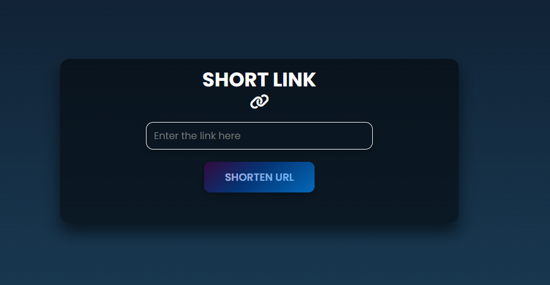
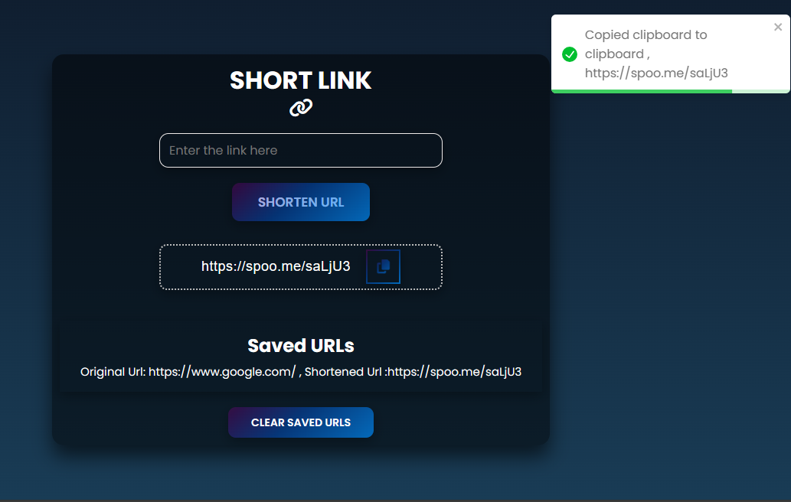

# URL Shortener Project

## Intro
The URL Shortener Project is a web application designed to shorten long URLs into more concise and shareable links. It provides users with a convenient way to generate short links for easy sharing on various platforms.

##  🛠️ Tech Stack
- **Frontend**: `React.js`
- **Styling**: `CSS`
- **State Management**: `React Hooks (useState, useEffect)`
- **API Integration**: `Fetch API` for interacting with the URL shortening service
- **Notifications**: `React-Toastify` for displaying user notifications


## 🚀 Features
- Shorten long URLs into compact links.
- Copy shortened URLs to the clipboard with a single click.
- Save and manage shortened URLs locally using browser storage.
- View previously saved URLs in the history section.
- Clear saved URLs from the history.

## 📝 Process
1. **Planning**: Defined project requirements and user stories.
2. **Design**: Created wireframes and UI mockups for the application.
3. **Development**: Implemented frontend functionality using React.js and styled components with CSS.
4. **Testing**: Conducted manual testing and debugging to ensure functionality and usability.
5. **Deployment**: Deployed the application to a hosting platform for public access.

## Learnings
- Gain proficiency in React.js and React Hooks for frontend development.
- Enhance understanding of API integration and asynchronous JavaScript.
- Improve knowledge of browser storage mechanisms like LocalStorage.
- Learned to use the React-Toastify library for displaying user notifications.

## 🤔 How Can It Be Improved?
- Implement server-side URL shortening for better security and reliability.
- Enhance accessibility features for users with disabilities.
- Optimize performance and loading times for improved user experience.
- Add user authentication and account management functionality.

## Running the Project
1. Clone the repository: `git clone <repository-url>`
2. Navigate to the project directory: `cd url-shortener`
3. Install dependencies: `npm install`
4. Set up environment variables:
   - Create a `.env` file in the root directory.
   - Add the following environment variables:
     ```
     VITE_API_KEY=your-api-key
     VITE_BASE_URL=your-base-url
     ```
5. Start the development server: `npm start`


<details>
<summary><h3> 🎥 - Demo Video </h3></summary>

#

<video width="500" height="500" controls>
  <source src="https://github.com/Kainat18/Url-Shortener/assets/92010815/a8a56a3f-f61c-4828-b4b9-a759f9041d14" type="video/mp4">
 
</video>
</details>

<details>
<summary><h3> 📸 - Demo Images </h3></summary>

#



#



</details>

